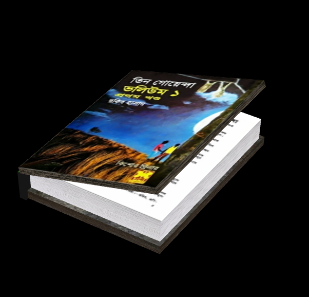
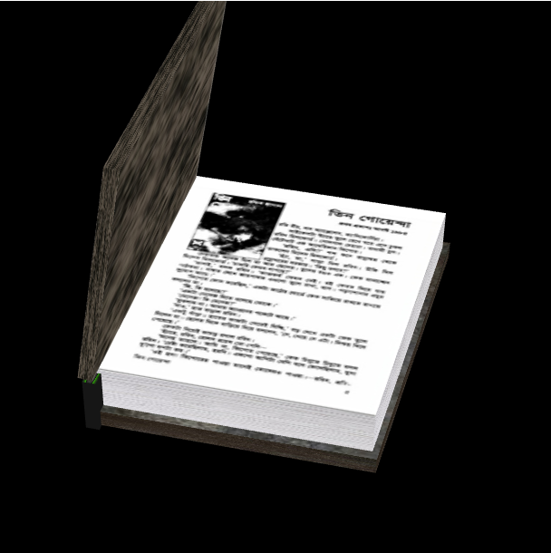

# 3DBook
 In this project I have created a 3D model of a book which can be rotated and the cover of the book can be opened and closed. This project was done using HTML,Javascript with WebGL and GLSL.

:fleur_de_lis:**Use "Web Server for Chrome" extension to select the project folder and load the HTML file.**
